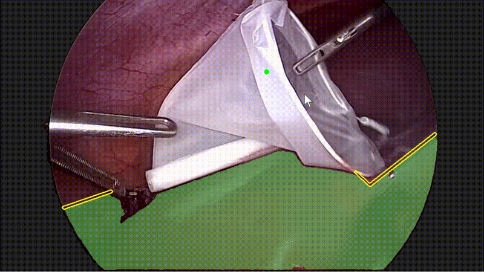
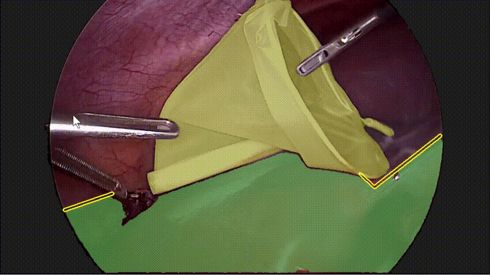
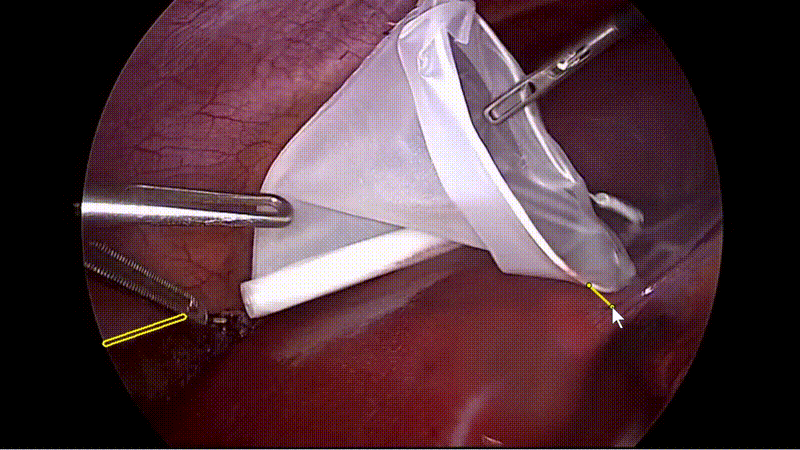
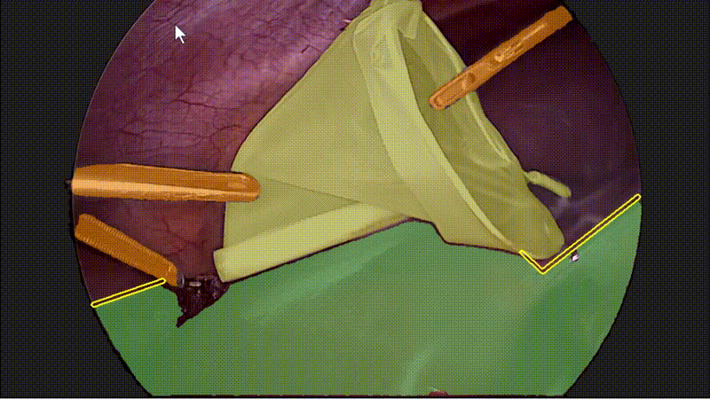
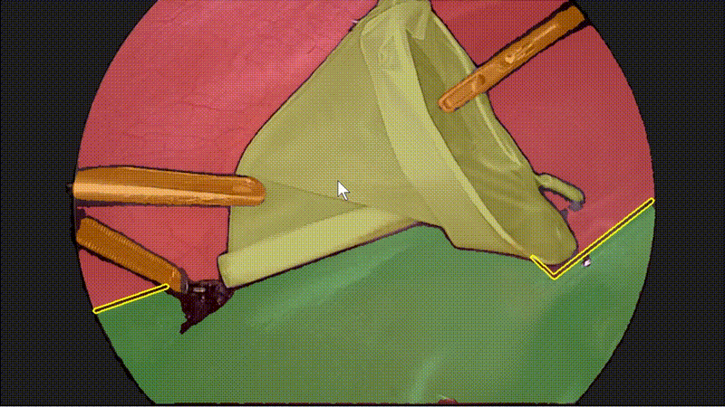
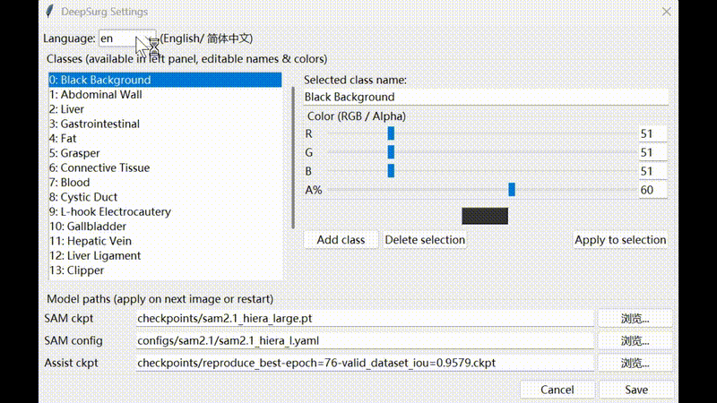

**[English](README.md) | 中文**

## DeepSurg Annotation Anything (基于 SAM2 的交互式标注工具)

本项目是一个基于 **SAM2** 的交互式医学图像标注工具，支持多类别掩码标注、鼠标点击/拖拽交互、手动补充边界、多边形区域选择以及后处理等功能。  
用户只需要准备好待标注图像和 SAM2 checkpoint，即可在本地快速完成精细标注。

---

### 演示动图

所有演示 GIF 均位于 `docs/media/` 目录，在 GitHub 页面中会直接显示为动图。

#### 1. 基本交互：点击选区 + 回车确认（video1 + video2）





#### 2. 手动添加边界：Add boundary（video3）

当自动分割的边界不理想，或者你希望在某些位置手动增加“切割线”时，可以使用 **Add boundary**：



#### 3. 多边形区域选择：Polygon region（video4）

适合处理边界模糊、不规则目标，通过多点连线来精准控制区域：



#### 4. 后处理与间隙填充（video5）

演示完成标注后，对所有类别掩码的后处理与间隙填充：



#### 5. 设置界面：语言 / 颜色 / 类别 / 模型（video6）

演示 Settings 界面：中英文切换、类别颜色、增删 class、模型切换等：



---

### 项目结构

```text
annotation_anything/
├─ sam_interactive_segmentation.py   # 主入口脚本
├─ sam2/                             # SAM2 推理相关源码
├─ configs/
│   └─ sam2/                         # SAM2 配置文件
├─ checkpoints/
│   └─ download_ckpts.sh             # SAM2 checkpoint 下载脚本（不含权重）
├─ images/                           # 输入图像（仓库中仅保留空目录）
├─ images_mask/                      # 中间结果（可选，同样不提交具体图片）
├─ masks/                            # 输出掩码（仓库中仅保留空目录）
├─ docs/
│   └─ media/                        # 演示视频、GIF 等
├─ requirements.txt                  # Python 依赖
├─ run_annotation.bat                # Windows 一键启动脚本
└─ README.md
```

> 注意：`checkpoints/`、`images/`、`images_mask/`、`masks/` 目录在仓库中不包含具体图片或权重文件，仅作为路径占位。

---

### 环境安装

建议使用 Python 3.9+，并在虚拟环境中安装依赖：

```bash
cd annotation_anything

# 创建虚拟环境（可选）
python -m venv .venv
# Windows
.venv\Scripts\activate
# macOS / Linux
# source .venv/bin/activate

# 安装依赖
pip install -r requirements.txt
```

`requirements.txt` 中主要包括：

- `torch`, `torchvision`：基础深度学习框架  
- `numpy`, `Pillow`, `matplotlib`, `opencv-python`：数值计算与图像显示  
- `scipy`：后处理中的形态学/距离变换  
- `hydra-core`, `omegaconf`：构建 SAM2 模型所需  
- `segmentation-models-pytorch`（可选，用于 Assist 功能）

---

### 模型权重下载

本仓库**不包含任何模型 checkpoint**。  
请先下载 **SAM2.1** 权重到 `checkpoints/` 目录中。

#### 1. 下载 SAM2.1 checkpoints

在项目根目录执行：

```bash
cd checkpoints
bash download_ckpts.sh
```

脚本会从官方地址下载以下文件到 `checkpoints/`：

- `sam2.1_hiera_tiny.pt`
- `sam2.1_hiera_small.pt`
- `sam2.1_hiera_base_plus.pt`
- `sam2.1_hiera_large.pt`

默认配置（可在 `sam_interactive_segmentation.py` 顶部修改）为：

```python
SAM2_CHECKPOINT = "checkpoints/sam2.1_hiera_large.pt"
SAM2_CONFIG     = "configs/sam2.1/sam2.1_hiera_l.yaml"
```

你可以根据显存情况改成 `small` 或其它版本。

#### 2. （可选）Assist 模型权重

如果希望启用界面中的 **Model assist** 按钮，需要额外准备一个分割模型 checkpoint，例如：

```python
ASSIST_MODEL_CHECKPOINT = "checkpoints/your_assist_model.ckpt"
```

将自己的权重文件放到 `checkpoints/` 目录，并在脚本或设置界面中填入正确路径即可。  
如果暂时不需要 Assist，可忽略该功能。

---

### 准备数据

默认使用如下目录结构（目录已在仓库中建立，但不会包含具体图片）：

```text
annotation_anything/
├─ images/        # 待标注图像（png/jpg 等）
├─ images_mask/   # 中间结果（可选）
└─ masks/         # 输出掩码（会自动创建对应的 .png 掩码文件）
```

请将所有待标注的图像放入 `images/` 目录中。

---

### 运行方式

#### Windows

```bash
# 首次使用：先安装依赖
pip install -r requirements.txt
```

之后可以直接双击：

- `run_annotation.bat`：一键启动标注工具。

或者在命令行中运行：

```bash
python sam_interactive_segmentation.py
```

#### macOS / Linux

```bash
pip install -r requirements.txt
python sam_interactive_segmentation.py
```

（如需，也可以自己写一个 `run_annotation.sh`，内容为 `python sam_interactive_segmentation.py`。）

---

### 交互方式概览

- **鼠标左键点击**：添加提示点，自动识别区域边界，按 `Enter` 确认当前区域。  
- **Add boundary**：
  - 长按左键拖拽：绘制连续边界线（适合自动分割边界不准时手动补充）；
  - 左键单击多点连线：适合手动定义一条折线边界，右键撤销最后一个点，按 `Enter` 一次确认。
- **Polygon region**：
  - 左键多点选点、右键撤销最后一个点；
  - `Enter` 自动连接第一个点和最后一个点，封闭多边形并标注该区域。
- **后处理**：
  - 在完成标注后，对所有类别掩码进行连通域过滤、填洞、缝隙填充等操作，尽量消除未标注空洞。
- **Settings**：
  - 支持中英文界面切换；
  - 修改每个 class 的 Mask 颜色；
  - 增删 class；
  - 切换使用的 SAM2 模型等。

---

### 许可与引用

- SAM2 相关代码与配置来自 Meta 官方仓库，遵循其原始 License。  
- 本工程中新增的交互逻辑与标注界面代码，可按你选择的开源协议（例如 MIT / Apache-2.0）发布。

如在科研工作中使用本工具，建议在论文和项目中引用 SAM2 官方论文和你的相关工作。

